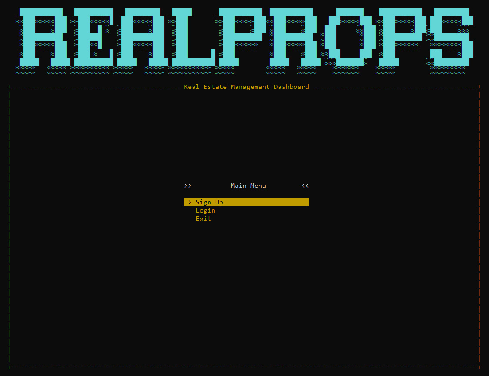
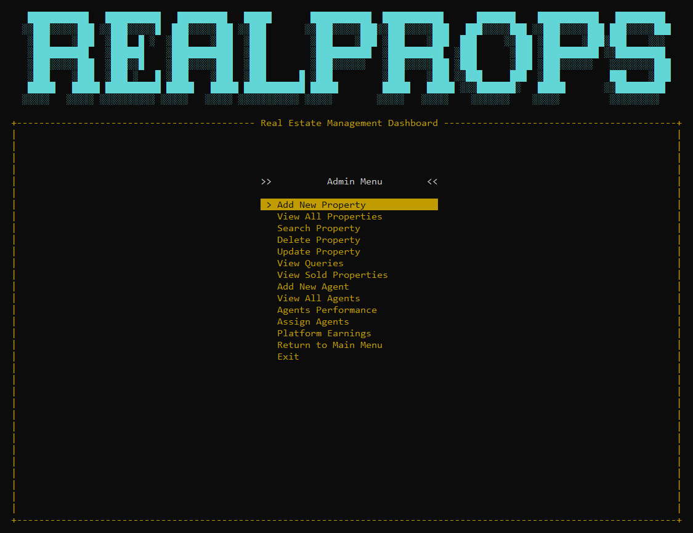

# 🏠 RealProps — Real Estate Management System (C++)

RealProps is a **console-based real estate management system** built entirely in **C++** as a first-semester computer science project.  
It goes beyond a typical CRUD application by focusing on **real-world logic, smooth menu navigation, and real-time searching** — all inside a console environment.

---

## 🚀 Features

- 📋 **Property Listings Management**  
  Add, view, update, and delete property records with structured data handling.

- 🔍 **Real-Time Search**  
  Search properties dynamically as you type for faster and smoother navigation.

- 🧭 **Menu-Based Navigation System**  
  No traditional “enter option number” flow — the system uses intuitive menu navigation for a better user experience.

- 👥 **Agent & User Management**  
  Manage agents, users, and their related transactions efficiently.

- 💰 **Financial Calculations**  
  Handles pricing, transactions, and related calculations within the system.

- 🎨 **Clean Console UI**  
  Designed to be visually organized, readable, and satisfying to use — even in a terminal.

---

## 🛠 Built With

- **Language:** C++  
- **Libraries:** None (Pure C++)  
- **Concepts Used:**
  - Structures
  - Pointers
  - Functions
  - Searching logic
  - Modular programming
  - Console UI design

---

## 🎯 Project Motivation

Instead of building a basic semester project, RealProps was created to **simulate a real-world system** and explore how actual applications are structured — focusing on both logic and user experience.

This project helped strengthen core C++ fundamentals while thinking beyond simple input-output programs.

---

## 📸 Demo

> 🎥 A short demo video and screenshots are available on my LinkedIn profile.

---

## 🔮 Future Improvements

- File handling (save & load data)
- Sorting properties by price, location, or type
- Authentication system
- Performance optimizations
- Enhanced console UI

---

## 📌 Author

**Abdur Rafay**  
First-Semester Computer Science Student  
Built with curiosity, logic, and a lot of C++
